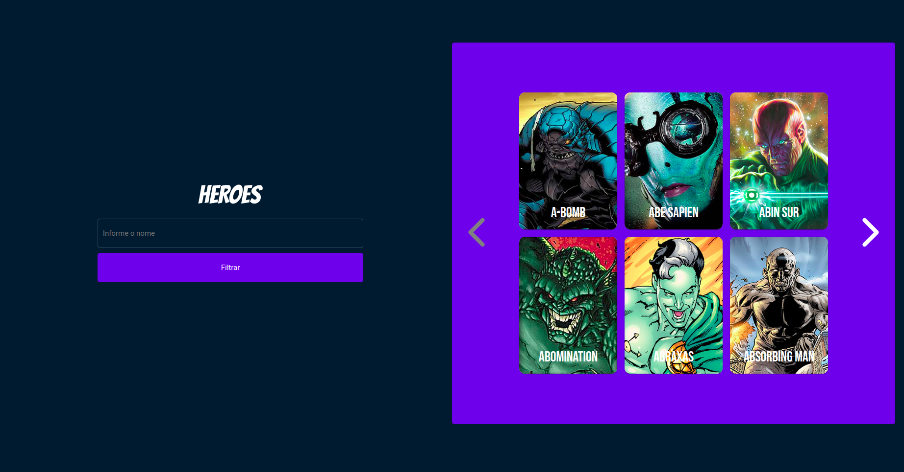
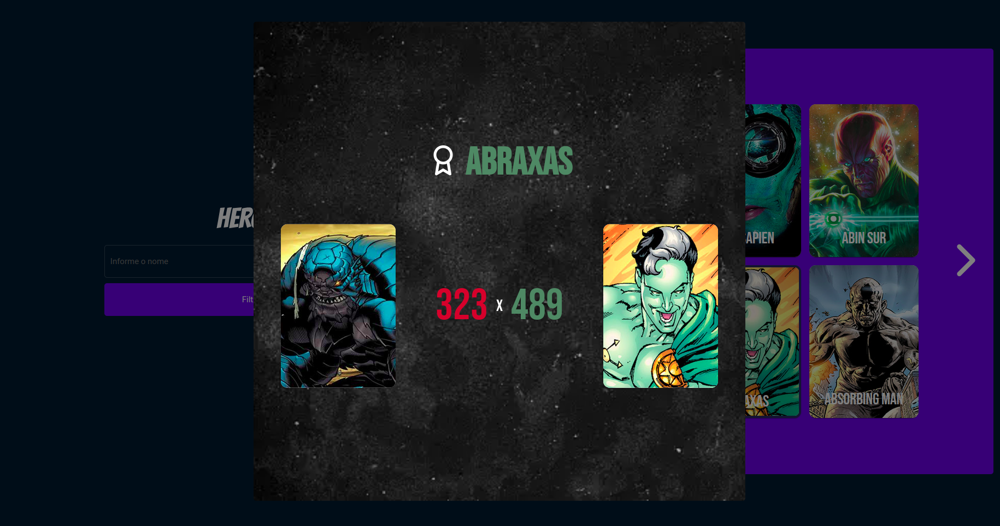
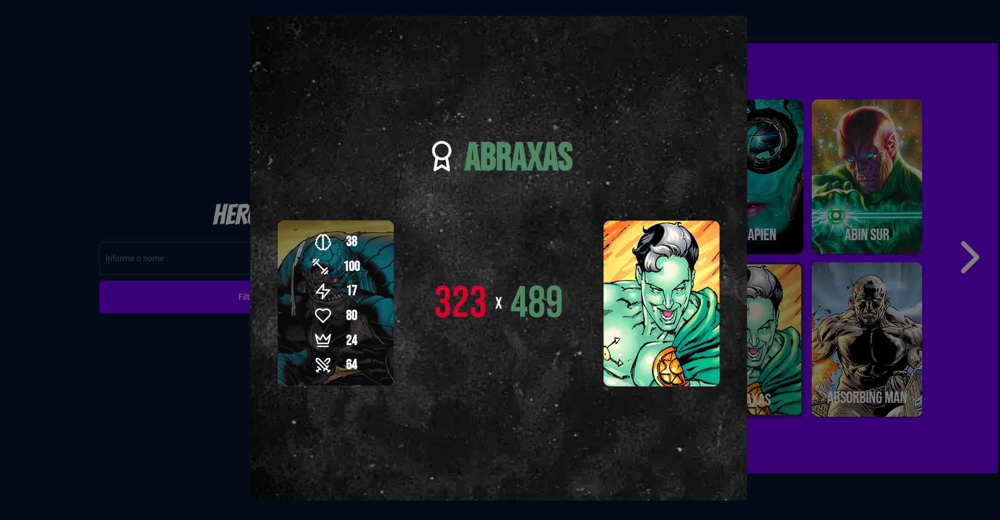

# JORNADA DO HERÓI

## Descrição
<strong>JORNADA DO HERÓI</strong> é um projeto desenvolvido para o teste técnico da vaga de Desenvolvedor Front end.

## Tecnologias utilizadas

<ul>
  <li>React</li>
  <li>Styled Components</li>
  <li>Material UI</li>
  <li>Context API</li>
  <li>Axios</li>
  <li>entre outras...</li>
</ul>

<br>

## Pré-requisitos

Antes de executar a aplicação, atente-se aos requisitos:
* Ter instalada a versão mais recente do `<Node.js e Yarn>`

<br>

## Executando o Projeto

Para executar o projeto, basta seguir o passo a passo:

1. Instale os pacotes<br>
```
>> yarn
```
2. Agora, é só executar os comandos:<br>

Para rodar a aplicação:
```
>> yarn dev
```

Pronto!

## PREVIEW


<br /><br />


<br /><br />


<br />
